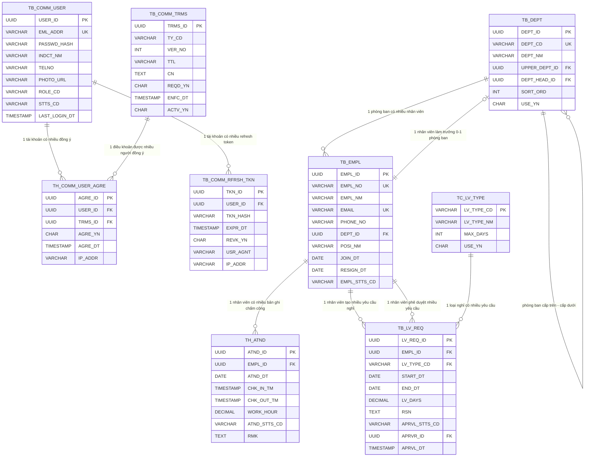

# ERD Diagram — HRLite

> Sơ đồ quan hệ thực thể (Entity Relationship Diagram)

```mermaid
erDiagram
    TB_COMM_USER ||--o{ TH_COMM_USER_AGRE : "1 tài khoản có nhiều đồng ý"
    TB_COMM_TRMS ||--o{ TH_COMM_USER_AGRE : "1 điều khoản được nhiều người đồng ý"
    TB_COMM_USER ||--o{ TB_COMM_RFRSH_TKN : "1 tài khoản có nhiều refresh token"

    TB_DEPT ||--o{ TB_EMPL : "1 phòng ban có nhiều nhân viên"
    TB_EMPL ||--o| TB_DEPT : "1 nhân viên làm trưởng 0-1 phòng ban"
    TB_DEPT ||--o{ TB_DEPT : "phòng ban cấp trên - cấp dưới"

    TB_EMPL ||--o{ TH_ATND : "1 nhân viên có nhiều bản ghi chấm công"
    TB_EMPL ||--o{ TB_LV_REQ : "1 nhân viên tạo nhiều yêu cầu nghỉ"
    TB_EMPL ||--o{ TB_LV_REQ : "1 nhân viên phê duyệt nhiều yêu cầu"
    TC_LV_TYPE ||--o{ TB_LV_REQ : "1 loại nghỉ có nhiều yêu cầu"

    TB_COMM_USER {
        UUID USER_ID PK
        VARCHAR EML_ADDR UK
        VARCHAR PASSWD_HASH
        VARCHAR INDCT_NM
        VARCHAR TELNO
        VARCHAR PHOTO_URL
        VARCHAR ROLE_CD
        VARCHAR STTS_CD
        TIMESTAMP LAST_LOGIN_DT
    }

    TB_COMM_TRMS {
        UUID TRMS_ID PK
        VARCHAR TY_CD
        INT VER_NO
        VARCHAR TTL
        TEXT CN
        CHAR REQD_YN
        TIMESTAMP ENFC_DT
        CHAR ACTV_YN
    }

    TH_COMM_USER_AGRE {
        UUID AGRE_ID PK
        UUID USER_ID FK
        UUID TRMS_ID FK
        CHAR AGRE_YN
        TIMESTAMP AGRE_DT
        VARCHAR IP_ADDR
    }

    TB_COMM_RFRSH_TKN {
        UUID TKN_ID PK
        UUID USER_ID FK
        VARCHAR TKN_HASH
        TIMESTAMP EXPR_DT
        CHAR REVK_YN
        VARCHAR USR_AGNT
        VARCHAR IP_ADDR
    }

    TB_DEPT {
        UUID DEPT_ID PK
        VARCHAR DEPT_CD UK
        VARCHAR DEPT_NM
        UUID UPPER_DEPT_ID FK
        UUID DEPT_HEAD_ID FK
        INT SORT_ORD
        CHAR USE_YN
    }

    TB_EMPL {
        UUID EMPL_ID PK
        VARCHAR EMPL_NO UK
        VARCHAR EMPL_NM
        VARCHAR EMAIL UK
        VARCHAR PHONE_NO
        UUID DEPT_ID FK
        VARCHAR POSI_NM
        DATE JOIN_DT
        DATE RESIGN_DT
        VARCHAR EMPL_STTS_CD
    }

    TH_ATND {
        UUID ATND_ID PK
        UUID EMPL_ID FK
        DATE ATND_DT
        TIMESTAMP CHK_IN_TM
        TIMESTAMP CHK_OUT_TM
        DECIMAL WORK_HOUR
        VARCHAR ATND_STTS_CD
        TEXT RMK
    }

    TB_LV_REQ {
        UUID LV_REQ_ID PK
        UUID EMPL_ID FK
        VARCHAR LV_TYPE_CD FK
        DATE START_DT
        DATE END_DT
        DECIMAL LV_DAYS
        TEXT RSN
        VARCHAR APRVL_STTS_CD
        UUID APRVR_ID FK
        TIMESTAMP APRVL_DT
    }

    TC_LV_TYPE {
        VARCHAR LV_TYPE_CD PK
        VARCHAR LV_TYPE_NM
        INT MAX_DAYS
        CHAR USE_YN
    }
```
